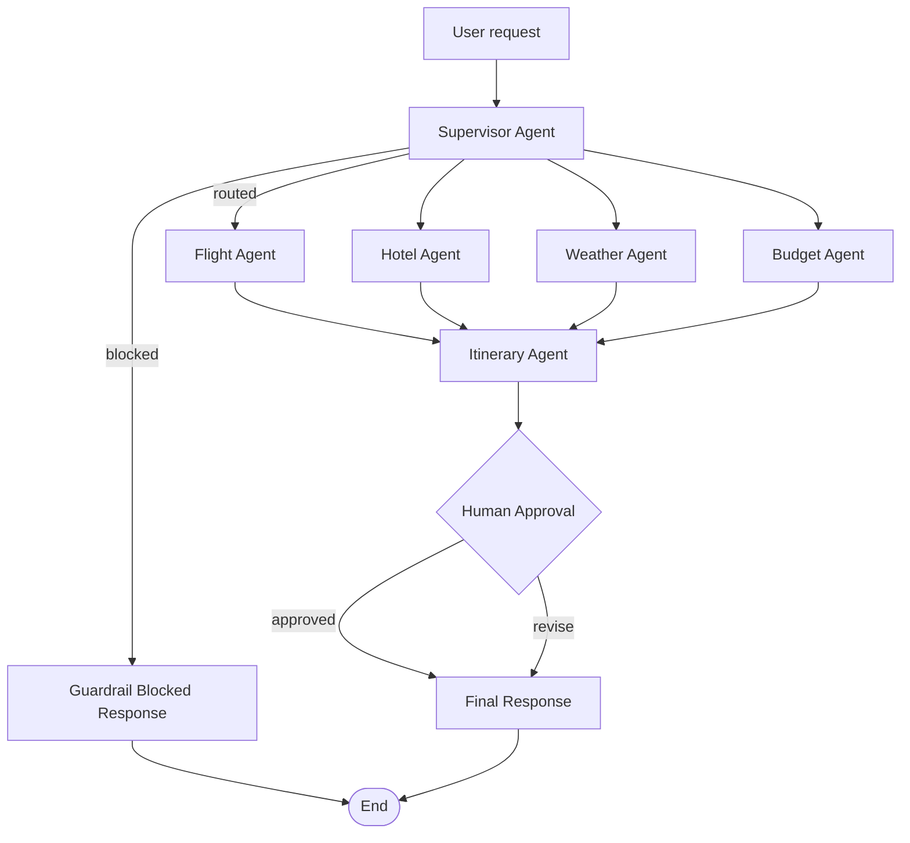

# ✈️ TripMate AI — Multi-Agent Travel Planner (LangGraph + FastAPI + React)

**TripMate AI** is a full-stack, production-deployed AI travel-planning platform powered by a **LangGraph multi-agent system**. It orchestrates specialist agents for flights, hotels, weather, and budget analysis, enforces an **input guardrail** to keep the assistant on-topic, and pauses for **human-in-the-loop approval** before finalizing any itinerary — combining autonomous AI planning with human oversight.

Built as a real-world case study in **agentic AI architecture, LLM orchestration, and serverless deployment engineering**, not just a prototype.

🔗 **Live demo:** [travelagent-ebon.vercel.app](https://travelagent-ebon.vercel.app/)
🔗 **Live API:** [mcp-bot-backend.vercel.app](https://mcp-bot-backend.vercel.app/) · [Health check](https://mcp-bot-backend.vercel.app/health)

---

## Table of contents

- [Why this project](#why-this-project)
- [Key features](#key-features)
- [Architecture](#architecture)
- [Tech stack](#tech-stack)
- [Engineering highlights](#engineering-highlights)
- [Getting started](#getting-started)
- [API reference](#api-reference)
- [Project structure](#project-structure)
- [Roadmap](#roadmap)
- [License](#license)

---

## Why this project

Most AI travel-planner demos are a single LLM call wrapped in a chat box. TripMate AI is designed differently: it models trip planning as a **coordinated system of specialist agents** with real guardrails, real state persistence, and a real human checkpoint before anything is finalized — the same patterns used in production agentic systems (supervisor routing, structured output validation, token-budget management, and graceful degradation when live data sources are unavailable).

## Key features

- 🧠 **Supervisor-routed multi-agent workflow** built on **LangGraph**, dynamically selecting which specialist agents (flights, hotels, weather, budget, itinerary) a request actually needs
- 🛡️ **Input guardrail agent** that filters out-of-scope or unsafe requests before any planning work begins
- 🙋 **Human-in-the-loop approval step** — every draft itinerary pauses for explicit approval or revision feedback before being finalized
- 🌐 **Live data via MCP (Model Context Protocol) tool calls** for flights/airports, hotels, current weather, and forecasts
- 💾 **Durable conversation state** using MongoDB-backed LangGraph checkpoints, so a trip-planning thread can be paused and resumed
- ⚡ **Token-budget-aware LLM calls** with automatic prompt shrinking and retry logic to stay within rate limits without losing response quality
- ✅ **Structured-output validation** that checks generated itineraries for completeness (flights, hotels, budget, day-by-day plan) before showing them to the user
- 🎨 **React 19 + TypeScript + Tailwind v4** chat interface for a fast, modern planning experience

## Architecture



The supervisor inspects each request, decides which specialist agents are relevant, and routes the LangGraph state machine accordingly. Every run pauses at the human-approval node — the itinerary agent never has the final word.

## Tech stack

| Layer | Technology |
|---|---|
| **Agent orchestration** | LangGraph, LangChain |
| **LLM** | Groq (`openai/gpt-oss-120b`) via `langchain-groq` |
| **Tool integration** | MCP (Model Context Protocol) adapters for flights, hotels, weather |
| **Backend API** | FastAPI, Python 3.12 |
| **State persistence** | MongoDB Atlas via `langgraph-checkpoint-mongodb` |
| **Frontend** | React 19, TypeScript, Vite, Tailwind CSS v4 |
| **Deployment** | Vercel (serverless Python + static frontend) |

## Engineering highlights

A few problems solved along the way that go beyond typical tutorial-level AI apps:

- **Serverless Python + async agent code**: resolved a subtle `nest_asyncio` vs. Python 3.12's `asyncio.run(loop_factory=...)` incompatibility that only surfaced inside Vercel's serverless bootstrap — a class of bug that doesn't show up in local development at all.
- **Groq TPM-aware request pacing**: a rolling token-bucket rate limiter (`_reserve_tpm`) keeps the app under Groq's tokens-per-minute ceiling across multiple agent calls in a single trip-planning run, with automatic prompt truncation and retries on token-limit errors.
- **Resilient tool integration**: every MCP tool call (flights, hotels, weather) degrades gracefully to a clearly labeled non-live fallback instead of crashing the whole planning run if a live data source is unavailable.
- **Structured JSON recovery**: a multi-layer JSON repair pipeline (fenced-block extraction, trailing-comma fixes, Python-literal fallback) recovers usable itinerary data even when the LLM's output isn't perfectly formed.

## Getting started

### Prerequisites

- Python 3.12+ and `pip`
- Node.js and npm
- A MongoDB connection string (e.g. MongoDB Atlas free tier)
- A [Groq](https://console.groq.com) API key

### Environment setup

Create a `.env` file inside `backend/`:

```env
GROQ_API_KEY=your_groq_api_key
MONGODB_URI=mongodb://localhost:27017/travel_agent_mcp
TAVILY_API_KEY=your_tavily_api_key
AVIATIONSTACK_API_KEY=your_aviationstack_api_key
OPENWEATHER_API_KEY=your_openweather_api_key
```

### Run the backend

```bash
cd backend
python -m venv .venv
.venv\Scripts\Activate.ps1   # Windows PowerShell
pip install -r requirements.txt
python app.py
```

Backend runs at `http://127.0.0.1:8000`.

### Run the frontend

```bash
cd frontend
npm install
npm run dev
```

Frontend runs at `http://localhost:5173`. Set `VITE_API_BASE_URL` in `frontend/.env` if pointing at a non-local backend.

### Typical workflow

1. Start the backend and frontend.
2. Describe a trip in the chat ("5 days in Tokyo in December, mid-range budget").
3. The supervisor routes the request to the relevant specialist agents.
4. Review the generated draft itinerary.
5. Approve it, or send revision feedback to regenerate a refined plan.

## API reference

| Method | Endpoint | Description |
|---|---|---|
| `POST` | `/api/travel` | Start a new trip-planning run |
| `POST` | `/api/travel/approve` | Approve or request revisions on a draft itinerary |
| `GET` | `/health` | Backend health check |

## Project structure

```
MCP_bot/
├── backend/          # FastAPI app, LangGraph workflow, specialist agents, MCP client
│   ├── app.py         # FastAPI entrypoint and API routes
│   ├── backend.py      # LangGraph graph definition and agent logic
│   └── client/         # MCP tool clients (flights, weather)
├── frontend/         # React + TypeScript + Vite UI
│   └── src/
│       ├── api/         # Backend API client
│       ├── components/  # Chat UI components
│       └── hooks/       # Travel-planning state hook
└── LICENSE
```

## Roadmap

- [ ] Native `async`/`await` agent functions to remove the `nest_asyncio` dependency entirely
- [ ] Streaming responses for real-time agent progress in the UI
- [ ] Additional specialist agents (visa requirements, local transit)

## License

Licensed under the MIT License. See [`LICENSE`](./LICENSE) for details.

---

<p align="center">Built by <a href="https://github.com/govin-raaj">govin-raaj</a> — feedback and contributions welcome.</p>